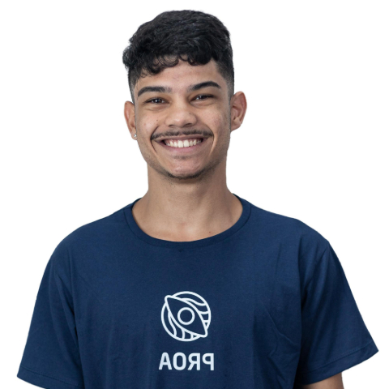

  
  <h1 align="center">Mapa de Carreira</h1>

</a>

> Mapa de Carreira na área de Back-End e Análise de Dados

# Acesso
 [Clique aqui para acessar! :)](https://mapadecarreira-fellype.vercel.app/)

## Introdução
- Bem-vindo ao meu mapa de carreira, onde compartilho minha jornada e objetivos nas áreas de Backend e Análise de Dados. Este README foi criado para fornecer uma visão geral das minhas aspirações profissionais, bem como dos passos que estou tomando para alcançá-las.

## Objetivo
Meu objetivo é desenvolver uma carreira sólida como profissional de tecnologia, com foco nas áreas de Backend e Análise de Dados. Procuro oportunidades que me permitam aplicar minhas habilidades técnicas para resolver problemas complexos e agregar valor aos projetos em que estou envolvido.

## Caminho Profissional
1. Aprendizado Contínuo
Estou comprometido em continuar aprendendo e aprimorando minhas habilidades em programação, banco de dados, e análise de dados. Isso inclui a participação em cursos online, workshops e projetos práticos.

2. Experiência Prática
Busco oportunidades de estágio, freelas e projetos pessoais que me permitam ganhar experiência prática em desenvolvimento de software, manipulação de dados e análise estatística.

3. Networking
Estou construindo e expandindo minha rede profissional por meio de participação em eventos, grupos de estudo e plataformas online. Procuro conexões que possam oferecer orientação, oportunidades de colaboração e insights sobre o mercado de trabalho.

4. Desenvolvimento de Projetos
Estou trabalhando em projetos pessoais relacionados a backend e análise de dados, buscando aplicar meus conhecimentos em ambientes reais e desenvolver um portfólio significativo.

## Próximos Passos
- Concluir o curso de PROPROFISSÃO.
- Aprofundar meu conhecimento em SQL e bancos de dados relacionais.
- Ingressar em uma empresa em alguma dessas áreas.
- Participar de hackathons, competições e tirar certificados para testar minhas habilidades e expandir minha rede.

##  Contato
- Estou sempre aberto a oportunidades de colaboração, orientação e networking. Sinta-se à vontade para entrar em contato comigo através do meu perfil do LinkedIn ou pelo meu email (fellypeoliveira2020@gmail.com).
---